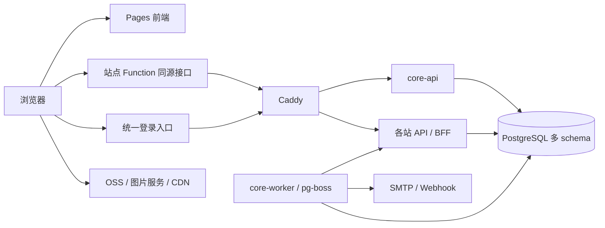

# 统一身份与服务中心设计

## 组件选型

采用嵌入 Node.js 的认证库、一个 PostgreSQL 实例和一个后台 worker。各子站保留独立仓库与实例，Pages 托管前端，Function 提供同源入口和轻量聚合。性能以整机测试为准，具体标准见[运行与部署](operations.md)。

| 能力 | 采用方案 | 使用标准 |
|---|---|---|
| 服务端 | Node.js 24 LTS、TypeScript、Fastify 5 | 运行编译后的 JS，每个服务一个进程，依赖固定版本 |
| 统一认证 | Better Auth + `@better-auth/oauth-provider` | 同一实例完成账号、GitHub OAuth、邮件验证、会话和 OIDC |
| OIDC 客户端 | `openid-client` | 授权码 + S256 PKCE，精确登记自有站点回调 |
| JWT/JWKS | `jose` | 优先 RS256，校验 issuer、audience 和算法，公钥缓存后本地验签 |
| 请求校验 | Fastify JSON Schema/Ajv | 使用一套 schema，过滤、排序和页大小均受限制 |
| 数据库 | PostgreSQL 18、`pg` | 一个业务 database，多服务 schema、多账号、小连接池 |
| SQL | Kysely、独立迁移文件 | 显式 SQL 契约；认证表由 Better Auth schema 生成工具管理 |
| 任务 | `pg-boss` | 复用 PostgreSQL，持久化依赖、有限重试和幂等执行 |
| 邮件 | Nodemailer + SMTP 服务 | 复用单个 transporter，发送并发 1，后台重试 |
| OSS | AWS SDK v3 | 首期使用 S3 兼容接口，签发直传授权并通过 HeadObject 确认 |
| Webhook | 厂商 SDK；自有接口 HMAC-SHA256 | 原始正文验签，事件去重，接收与业务完成分别记录 |
| 面板 | Vite/React、原生 fetch | 服务目录、会话管理、任务、数据和健康状态 |
| 部署 | Docker Compose v2、Caddy | 独立镜像、资源限制、自动 HTTPS、固定版本 |
| 观测 | Pino、`perf_hooks`、PostgreSQL 统计 | 日志轮转，记录请求耗时、连接数、队列年龄和资源 |
| 备份 | `pg_dump` / `pg_restore` + restic | 一致备份后加密异地存储，定期验证恢复 |

### 认证方案比较

| 方案 | 部署和成本 | 结论 |
|---|---|---|
| Better Auth + OAuth Provider | Node.js 库，复用中心进程与 PostgreSQL，UI 可自定义 | 首选；上线校验 OIDC、账号关联、退出和插件版本兼容 [C01–C04] |
| `oidc-provider` | 成熟的 Node.js 协议服务库，账号流程与持久化另行集成 | 标准协议要求扩大时的备选，官方列有 OpenID 认证 [C05] |
| ZITADEL | 独立身份服务和 PostgreSQL；官方 1 CPU/512 MB 描述针对测试环境 | 需要完整身份产品时评估整套部署资源 [C06] |
| Authentik | 官方小规模部署要求至少 2 核、2 GB | 本机多业务共存时资源余量有限 [C07] |

PostgreSQL 已满足独立身份平台的数据库前提，嵌入式方案仍因附加进程少、接入现有 Node.js 系统方便而优先。全系统使用一个授权服务器；以 OIDC 和稳定内部 ID 保留替换能力。

## 服务边界

| 服务 | 职责 | 数据写权限 |
|---|---|---|
| `core-api` | 认证、服务注册、个人中心、管理 API、跨站读取 | `auth`、`core` 和提交队列所需权限 |
| `core-worker` | 任务、邮件、Webhook、重试、操作状态 | `core` 的任务表、`jobs`；业务命令发往所属站点 |
| 各站点 API/BFF | 会话、CRUD、专属计算 | 各自 `site_*` schema |
| 评论、RSS、状态服务 | 按原有职责独立发布 | 自有 schema 或只读账号 |
| PostgreSQL、Caddy | 数据存储与网络入口 | 独立基础设施权限 |

中心的账号管理、服务目录和聚合是同一 API 中的模块。管理面板负责服务接入、状态和任务查询；自动重试由 worker 管理，终态失败使用新幂等键提交新操作。部署与重启由 CI/SSH 运维身份执行。

## 数据组织与权限

一致查询的数据放在同一个业务数据库 `sm`，使用 `auth`、`core`、`jobs`、`site_a` 等 schema。每个站点拥有独立账号、迁移和对象模型；运行账号与 schema owner/迁移角色分离。中心不会获得业务写权限。

各站点发布版本化视图，如 `site_a.profile_public_v1`，显式列出可读字段。中心专用的 `center_reader` 账号只获指定 schema 的 `USAGE` 和视图的 `SELECT`；不读取密码、会话凭据等认证内部数据。中心跨站查询池固定使用该账号。

终端用户权限由中心验证，根据内部用户 ID 和 scope 过滤视图结果。涉及敏感数据时，采用经验证的 RLS 或受限访问函数进一步约束；测试须覆盖视图所有者和调用者的权限行为。仅有数据库只读权限仍不足以授权读取任意用户数据。

跨站查询使用同一连接的 `REPEATABLE READ READ ONLY` 事务，所有查询共享快照。业务服务通过自身账号修改数据，中心提交命令后等待业务提交。金额、配额或订阅权益等必须原子完成的约束，集中在一个业务所有者的事务内。详情见[一致性标准](consistency.md)。

## 身份与登录

认证库的内部用户 ID 是稳定身份，账号、会话、邮件验证和外部身份记录由认证库管理。GitHub 用户登录使用 OAuth 和稳定的 GitHub 用户 ID；外部 OIDC 提供方使用 `issuer + subject` 关联。邮箱用于验证和联系，账号关联要求已登录用户重新验证，避免通过相同邮箱自动合并。

站点采用授权码 + S256 PKCE，验证 `state`、`nonce`、issuer 和回调。BFF 使用 `openid-client` 完成令牌兑换，并建立本站会话。中心和各站分别使用 `HttpOnly`、`Secure`、host-only Cookie；普通顶层跳转采用 `SameSite=Lax`，修改请求执行 Origin/CSRF 校验。refresh token 加密存储于服务端。

跨独立域名采用相同登录协议。React SDK 提供登录、用户状态与退出，认证页使用顶层跳转。Function 转发同源 BFF 请求，保留多个 `Set-Cookie`，认证响应设置 `Cache-Control: no-store`。数据库连接和账号逻辑留在 Node.js 服务。

普通用户自选二次验证，admin 使用二次验证与恢复码。公开注册启用邮件验证、限流和恢复；登录邮件进入高优先级任务队列。

### 会话与撤销标准

中心和 BFF 会话采用固定 7 天有效期；中心关闭自动续期，集成层额外保留 30 天上限校验。API access token 有效期 5 分钟。BFF 验证本站会话，对中心授权状态最多缓存 30 秒；敏感修改可强制在线核对。中心撤销后，普通受保护请求在 60 秒内停止授权。

BFF 提供 Back-Channel Logout 验签接收端，首期登记客户端依赖周期性 userinfo 核对完成撤销。全站退出删除 refresh token 并撤销中心会话，已通过真实 BFF 测试 [C02]。中心不可用时，缓存到期后的受保护请求返回暂时不可用；公共静态内容继续服务。

## 签名与外部服务

`jose` 校验令牌声明和签名，JWKS 缓存在进程内，未知 `kid` 触发有界刷新。采用 RS256。首期自有服务命令使用每目标独立的 HMAC-SHA256 密钥和命令权限清单，用户 ID 由中心会话确定；扩展第三方机器授权时增设 audience/scope 受限的 client credentials。

OSS 授权初始有效期 5 分钟，约束对象 key、操作和前缀。支持大小范围的策略限定上传大小，其他方式在确认阶段核对对象元信息。上传完成状态由 OSS 元信息或已验签回调确认。图片 CORS 配置精确来源和方法，字节流由 OSS/CDN 传输。

自有 Webhook 采用 HMAC-SHA256，每个接收方独立密钥，签名包含事件 ID、时间戳与原始正文；接收端执行常量时间比较与持久化去重。外部提供方采用其官方 SDK。邮件已接收、支付已确认、业务已提交分别具有明确状态。

## 服务模型与 API

服务登记 `service_id`、名称、公开域名、OAuth client、回调、scope 和接入状态。允许命令与远端地址通过环境配置，版本视图通过迁移 CLI 登记。生产与预览环境使用不同 client 和凭据，用户私有内容按会话归属过滤。

API 使用 `/v1`、JSON、统一错误码、请求 ID 与 RFC 3339 时间。分页默认 20 条、最多 100 条，普通列表采用稳定 cursor；管理列表按需要提供页码和显式总数。高风险写入和异步提交支持 `Idempotency-Key`；操作状态接口检查发起用户与服务权限。

支付预留订单、交易、订阅与权益模型，金额用最小货币单位整数。网关按运营主体和地区确定，Stripe 官方 SDK 为支持地区的候选；SDK 与商业网关费用分别评估。已验签支付事件去重和权益更新在所属服务事务内完成。
